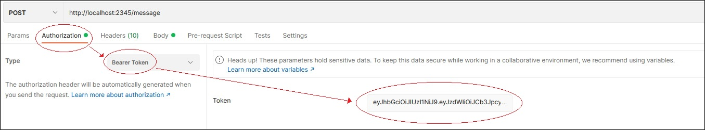
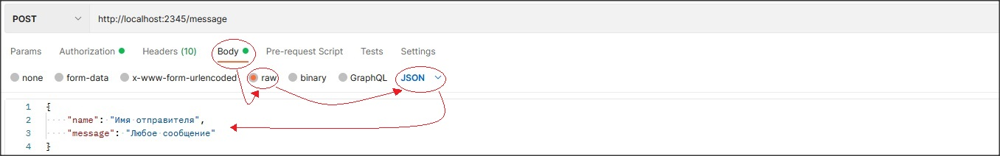
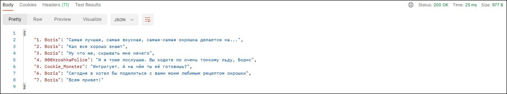

#  Local message service
## Реализация сервера сообщений с использованием REST API, включающая в себя следующие компоненты: 
- **Авторизация** - авторизация пользователя по логину и паролю
- **Аутентификация** - аутентификация пользователя по JWT токену
- **CRUD операции** - API взаимодействует БД postgreSQL
- **REST service** - имеется ряд HTTP эндпоинтов работающих с данными в формате JSON
- **Test automation** - реализовано автоматическое тестирование с помощью JUnit
- **Шифрование** - для хранения паролей в БД используется AES - симметричный алгоритм блочного шифрования

***Содержание:***

- [Подробное описание](#Description)
- [Инструкция по запуску](#Launch)
- [Шаблоны запросов](#Template) 
- [Список использованных технологий](#Technologys)


## Подробное описание <a name="Description"></a> 
После запуска сервер будет ожидать запросов по адресу `http://localhost:2345`.
На любой запрос неавторизованного пользователя будет получен ответ: 

`401 Unauthorized`

```javascript
{
    error: "unauthorized"
}
```
Для авторизации нужно отправить POST запрос добавив в тело данные пользователя в следующем виде:

```javascript
{
    "name": "имя отправителя",
    "password": "пароль"
}
```
этот запрос нужно отправить на один из двух адресов:
- `http://localhost:2345/auth/register`
- `http://localhost:2345/auth/login`

В первом случае будет создан новый пользователь, во втором выполнена авторизация в уже существующего,
в обоих случаях в ответе будет сгенерирован JWT токен 

```javascript
{
    status: "successful authorization",
    user: "guest",
    token: "*токен авторизации*"
}
```
Сохраните полученный токен, или выполните повторную авторизацию если потеряли его. C этого момента вы можете пользоваться службой сообщений. 
Для этого отправьте POST запрос по этому адресу: 

`http://localhost:2345/message`

В тело запроса необходимо добавить имя отправителя и само сообщение, а в заголовках указать авторизацю через токен.
Шаблон запроса на примере платформы Postman (https://www.postman.com/)




Если вы отправили сообщение формата `"history %d"`, где %d это любое целое число, например "history 10", 
то вам в ответ придёт %d последних отправленных сообщений. 



В остальных случаях ваше сообщение будет сохранено в базу данных.

## ❗ Инструкция по запуску <a name="Launch"></a> ❗
Существует три способа запуска данного сервиса. Пойдём от простого к сложному:

- Нужен только установленный `Docker`. В терминале выполните данную команду: `docker run sibugato/inside-demo-project`. 
Скачивание, создание контейнера, запуск. От вас ничего больше не требуется. Можете приступить к [регистрации первого пользователя](#Description)


- К нашим требованиям добавляется среда разработки и установленный `Maven` для сборки проекта. Сначала клонируйте себе этот репозиторий, 
затем подготовьте  .jar файл сервиса. Выполните в терминале среды 
разработки  команду `mvn clean install`. Будет выполнена сборка проекта и последующее создание необходимого нам артефакта. Теперь объединяем его с образом
   `PostgreSQL` в докере и можно приступать к использованию сервиса. Просто выполните в терминале среды разработки вторую команду: `docker-compose up` и вы получили тот же результат, что и в первом методе.


- Самый сложный из представленных способов, но тоже возможен. Требования пополнились установленным `PostgreSQL`. Докер не требуется. Клонируете проект, затем создаёте в pgAdmin Базу данных. Подключите её к среде разработки.
После этого создайте 2 таблицы в указанном порядке. 
Для быстроты просто используйте эти SQL запросы в консоли БД. При желании можете создать вручную.
```sql
CREATE TABLE users (
    id SERIAL,
    login VARCHAR (32) PRIMARY KEY NOT NULL,
    password TEXT NOT NULL
)
```
```sql
CREATE TABLE messages (
    id SERIAL,
    author VARCHAR (32),
    message TEXT NOT NULL,
    FOREIGN KEY (author) REFERENCES users(login)
)
```
После этого запускайте сервер через класс `InsideDemoProjectApplication`. 
Готово, можно пользоваться сервисом. Начните с [регистрации первого пользователя](#Description). Если взаимодействие с БД происходит некорректно -
убедитесь что поля сущностей в пакете `model` корректно соотносятся с соответствующими полями таблиц.


## ❗ Шаблоны запросов <a name="Template"></a> ❗

### Регистрация
- Тип запроса: `POST`
- URL: `http://localhost:2345/auth/register`
- Тело запроса:
```javascript
{
    "name": "имя отправителя",
    "password": "пароль"
}
```
возможные ответы:
```javascript
error: "«name» field empty or missing"               (401 Unauthorized)
```
```javascript
error: "«password» field empty or missing"           (401 Unauthorized)
```
```javascript
error: "user already exist"                          (401 Unauthorized)
```
```javascript
status: "account created successfully"               (201 Created)
user:   "Имя пользователя"
token: "*токен авторизации*"
```
### Авторизация

- Тип запроса: `POST`
- URL: `http://localhost:2345/auth/login`
- Тело запроса:
```javascript
{
    "name": "имя отправителя",
    "password": "пароль"
}
```
возможные ответы:
```javascript
error: "«name» field empty or missing"               (401 Unauthorized)
```
```javascript
error: "«password» field empty or missing"           (401 Unauthorized)
```
```javascript
error: "invalid credentials"                         (401 Unauthorized)
```
```javascript
status: "successful authorization"                   (202 Accepted )
user:   "Имя пользователя"
token: "*токен авторизации*"
```
### Отправка сообщения

- Тип запроса: `POST`
- URL: `http://localhost:2345/message`
- заголовок: `Authorization: Bearer_*токен авторизации*`
- Тело запроса:
```javascript
{
    "name": "имя отправителя",
    "message": "любое сообщение"
}
```
- Формат сообщения: любой кроме `"history %d"`, где %d это любое целое число
- Формат имени: имя отправителя должно соответствовать авторизованному пользователю

возможные ответы:
```javascript
error: "«name» field empty or missing"               (406 Not Acceptable)
```
```javascript
error: "«message» field empty or missing"            (406 Not Acceptable)
```
```javascript
error: "there is no such user"                       (401 Unauthorized)
```
```javascript
error: "token does not belong to the user"           (403 Forbidden )
```
```javascript
status: "message saved successfully"                 (201 Created)
```

### Запрос истории сообщений

- Тип запроса: `POST`
- URL: `http://localhost:2345/message`
- заголовок: `Authorization: Bearer_*токен авторизации*`
- Тело запроса:
```javascript
{
    "name": "имя отправителя",
    "message": "history 16"
}
```
- Формат сообщения: `"history %d"`, где %d это любое целое число
- Формат имени: имя отправителя должно соответствовать авторизованному пользователю

возможные ответы:
```javascript
error: "«name» field empty or missing"               (406 Not Acceptable)
```
```javascript
error: "«message» field empty or missing"            (406 Not Acceptable)
```
```javascript
error: "there is no such user"                       (401 Unauthorized)
```
```javascript
error: "token does not belong to the user"           (403 Forbidden )
```
```javascript
warning: "there, below zero, is nothing to show..."  (200 OK)
```
```javascript
status: "there no messages for now, be first!"       (200 OK)
```
```javascript
1. *пользователь*: "*сообщение*",                    (200 OK)
2. *пользователь*: "*сообщение*",
3. *пользователь*: "*сообщение*",
...
```
## **cURL запросы** 
- ### Для командной строки (Windows)

 Регистрация:
```javascript
`curl -X POST -H "Content-Type: application/json" -d "{ \"name\": \"guest\", \"password\": \"guest\" }" http://localhost:2345/auth/register`
```
Авторизация:
```javascript
`curl -X POST -H "Content-Type: application/json" -d "{ \"name\": \"guest\", \"password\": \"guest\" }" http://localhost:2345/auth/login`
```
Написать сообщение:
```javascript
`curl -X POST -H "Content-Type: application/json" -H "Authorization: Bearer_ТОКЕН" -d "{ \"name\": \"guest\", \"message\": \"Hello world!\" }" http://localhost:2345/message`
```
Просмотреть сообщения:
```javascript
`curl -X POST -H "Content-Type: application/json" -H "Authorization: Bearer_ТОКЕН" -d "{ \"name\": \"guest\", \"message\": \"history 10\" }" http://localhost:2345/message`
```

- ### Сгенерированные в Postman

Регистрация:
```javascript
curl --location --request POST 'http://localhost:2345/auth/register' \
--header 'Content-Type: application/json' \
--data-raw '{
"name": "guest",
"password": "guest"
}'
```
Авторизация:
```javascript   
curl --location --request POST 'http://localhost:2345/auth/login' \
--header 'Content-Type: application/json' \
--data-raw '{
"name": "guest",
"password": "guest"
}'
```

Написать сообщение:
```javascript
curl --location --request POST 'http://localhost:2345/message' \
--header 'Authorization: Bearer_ТОКЕН' \
--header 'Content-Type: application/json' \
--data-raw '{
"nae": "guest",
    "message": "Hello world!"
}
 ```

Просмотреть сообщения:
```javascript
curl --location --request POST 'http://localhost:2345/message' \
--header 'Authorization: Bearer_ТОКЕН' \
--header 'Content-Type: application/json' \
--data-raw '{
"nae": "guest",
"message": "history 10"
}
```

## Список использованных технологий <a name="Technologys"></a> ℹ️

- Spring Framework (Core, Boot, Web, Security, Test, Data JPA)
- PostgreSQL
- Maven
- JWT
- JUnit
